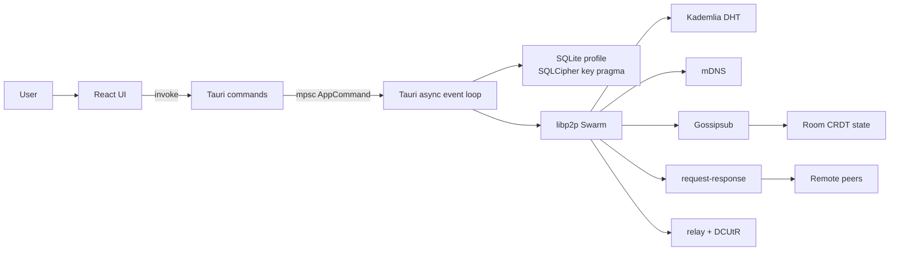

# AlterChat Architecture

This document describes the current AlterChat implementation as it exists in the
repository. It intentionally separates implemented behavior from future-facing
security goals so contributors can reason about the system without relying on
marketing language.

## Design Goals

AlterChat is built around five engineering goals:

1. **Local ownership:** keys, settings, trust decisions, and message history live
   on the user's machine.
2. **Peer-to-peer communication:** peers should be able to discover each other,
   exchange room state, send files, and route private messages without a
   central message service.
3. **Composable cryptography:** identity, transport encryption, local storage
   encryption, message encryption, and traffic privacy are separate layers.
4. **Human-scale trust:** the user can verify safety numbers, block peers, set
   trust thresholds, and grant room permissions without relying on a global
   authority.
5. **Operational transparency:** the repository should make it clear what is
   implemented, what is experimental, and what requires further hardening.

## Workspace Structure

```text
AlterChat-main/
├─ alterchat-core/
│  ├─ src/crypto.rs            X25519 payload encryption, sealed messages, safety numbers
│  ├─ src/double_ratchet.rs    Double Ratchet implementation and tests
│  ├─ src/x3dh.rs              X3DH + ML-KEM-768 shared secret path
│  ├─ src/network.rs           libp2p swarm construction and bootstrap config
│  ├─ src/crdt.rs              Automerge room state
│  ├─ src/governance.rs        invites, roles, permission grants, trust edges
│  ├─ src/storage.rs           file manifests and encrypted chunks
│  ├─ src/onion.rs             fixed-size onion packet wrapping and peeling
│  ├─ src/pluggable.rs         obfs4-style and snowflake-style obfuscation helpers
│  ├─ src/pow.rs               Hashcash-style PoW token
│  ├─ src/spam.rs              challenge/solution PoW helper
│  ├─ src/traffic.rs           padding, chaff, delay, PoW ban list
│  └─ src/plugin.rs            plugin manifest, policy, and host model
├─ alterchat-ui/
│  ├─ src/                     React application and WebRTC helpers
│  └─ src-tauri/src/
│     ├─ lib.rs                application event loop and IPC wiring
│     ├─ db.rs                 SQLCipher-backed SQLite schema and queries
│     └─ commands/             Tauri commands grouped by domain
├─ alterchat-bootstrap/        headless Kademlia bootstrap node
└─ libp2p-community-tor/       vendored Tor transport adapter
```

## Runtime Topology



The Tauri backend owns the main application state. UI commands are sent into a
single `mpsc` command channel as `AppCommand` values. The long-running backend
task multiplexes:

- commands from the UI
- libp2p swarm events
- DHT query results
- request-response messages
- Gossipsub room updates
- mDNS discovery events

This keeps high-level application state mutation centralized. The code still
uses local helper functions and database calls, but the communication path is
easier to audit because the externally visible actions pass through the same
command loop.

## Core Modules

### `identity`

`alterchat-core/src/identity.rs` provides:

- plain libp2p keypair load/generate
- encrypted keypair load/generate using `secure_storage`
- `:memory:` support for temporary identities

Peer identity is a libp2p Ed25519 keypair. The public key becomes the peer's
network identity through libp2p `PeerId`.

### `secure_storage`

`secure_storage.rs` derives a 256-bit key from a password and salt with Argon2id,
then encrypts payloads with AES-256-GCM. The serialized format is:

```text
[16-byte salt][12-byte nonce][ciphertext]
```

This helper is used for encrypted keypair and vault material. It is not a full
secret-management subsystem; memory locking, secure UI entry, and OS keychain
integration are future hardening areas.

### `crypto`

`crypto.rs` currently contains several cryptographic building blocks:

- X25519 encrypt-for-peer/decrypt-for-me helper.
- DHT record-key derivation helpers for offline inboxes and prekey bundles.
- safety number derivation from two X25519 public keys.
- sealed-sender style encrypted envelopes.
- encrypted X25519 secret load/generate.
- symmetric ratchet state for current compatibility paths.

The simple `RatchetState` is distinct from the fuller Double Ratchet module. New
protocol work should prefer a single canonical state machine and include a
migration plan for old state blobs.

### `x3dh`

`x3dh.rs` implements a hybrid X3DH-style shared secret flow:

- X25519 identity key
- signed X25519 prekey
- optional one-time prekey
- ML-KEM-768 encapsulation material
- HKDF-SHA256 output as 32-byte shared secret

Prekey bundles include signatures over the signed prekey and ML-KEM
encapsulation key. The current code provides the protocol material; integration
with DHT prekey lifecycle, replay prevention, and peer verification should be
carefully reviewed before treating it as production-ready.

### `double_ratchet`

`double_ratchet.rs` implements:

- DH ratchet state
- sending and receiving chain keys
- message counters
- previous-chain counter
- skipped-message key cache
- AES-256-GCM message encryption
- HKDF-SHA256 root and chain KDFs

Unit tests cover:

- Alice-to-Bob messages
- bidirectional messages
- out-of-order delivery
- basic forward-secrecy behavior

### `crdt`

Rooms are represented with Automerge. A room can:

- create a new CRDT document
- add messages
- merge remote document bytes
- list message entries

The Tauri backend saves room blobs in SQLite and publishes room state over
Gossipsub. This makes room history mergeable, but it also means room-level spam,
retention, and membership policy must be enforced above the CRDT layer.

### `governance`

Governance artifacts are Ed25519-signed data structures:

- invite tokens
- roles
- permission grants
- trust edges
- revocation announcements

Default room roles include owner/moderator/member/readonly style permission
sets. The Tauri backend seeds default governance for rooms and checks
permissions for actions such as writing, inviting, sending files, and starting
calls.

### `network`

`network.rs` composes the libp2p behavior:

- Kademlia with in-memory store
- Gossipsub with anonymous message authenticity
- mDNS local discovery
- Identify
- request-response with CBOR
- relay server
- relay client
- DCUtR hole punching

Supported transport paths:

- direct TCP with Noise and Yamux
- QUIC preference path
- Tor transport path through `libp2p-community-tor`
- relay transport
- I2P/SOCKS5 configuration fields, with full SOCKS5 routing still TODO

Community bootstrap addresses are intentionally configured as optional. They
help peers enter the DHT but should not become an authority layer.

### `file_transfer` and `storage`

`file_transfer.rs` defines the request-response protocol messages. It covers:

- file messages
- file chunks
- WebRTC signaling
- private messages
- ratchet private messages
- X3DH/Double Ratchet DMs
- capability announcements
- onion forwarding
- plugin events
- PoW challenge/solution messages

`storage.rs` implements file manifests, content hashing, 256 KiB chunking,
AES-256-GCM chunk encryption, and plaintext hash verification after decryption.

### `onion`, `traffic`, `pow`, and `pluggable`

These modules are privacy and abuse-resistance building blocks:

- `onion`: wraps payloads in fixed 16 KiB encrypted layers.
- `traffic`: pads messages, generates chaff payloads, and models random delays.
- `pow`: mints/verifies resource-bound PoW tokens.
- `spam`: challenge/solution PoW helper used by the UI command surface.
- `pluggable`: obfs4-style and snowflake-style obfuscation helpers.

They should be treated as experimental until measured against real network
fingerprints and adversarial traffic analysis.

### `plugin`

The plugin module defines:

- plugin capabilities
- signed plugin manifests
- policy checks
- a host model for executing plugin-like code

The database and Tauri commands can store/list plugin manifests. Running
untrusted plugin code is security-sensitive and should require dedicated review.

## Tauri Backend

### State

`alterchat-ui/src-tauri/src/lib.rs` defines `AppState`:

- command channel sender
- current database path
- current database key
- current key path
- current peer ID
- current offline public key

The backend's long-running task manages:

- active swarm
- current CRDT room
- SQLite connection
- local keypair and offline X25519 secret
- room governance
- rate-limit buckets
- PoW ban list

### IPC Commands

Command modules are grouped by domain:

| Module | Responsibility |
| --- | --- |
| `auth.rs` | login, amnesic profiles, panic wipe, PoW solving |
| `messaging.rs` | room send/join/search |
| `social.rs` | friends, DMs, peer settings, saved groups |
| `settings.rs` | profile settings, capacity, safety numbers, vault import/export |
| `governance.rs` | invites, roles, grants, trust edges |
| `media.rs` | file send, encrypted file preparation, WebRTC signaling |
| `room.rs` | per-room local settings |
| `storage.rs` | manifests, chunks, peer capabilities |
| `plugin.rs` | plugin registry commands |
| `system.rs` | network status and crypto capability summary |
| `network_cmds.rs` | distributed revocation and anonymous channel command paths |

### Database Schema

`db.rs` creates tables for:

- rooms
- settings and app settings
- friends
- private messages
- saved groups
- peer settings
- room settings
- ratchet states
- storage settings
- room invites
- room roles
- permission grants
- trust edges
- peer capabilities
- file manifests
- stored chunks
- plugin registry
- known peers
- prekey bundles
- revoked invites
- message search index

Schema migrations are currently handled with `CREATE TABLE IF NOT EXISTS` plus
best-effort `ALTER TABLE` statements. Future migrations should become explicit,
versioned, and tested.

## Desktop Frontend

The React application provides:

- password login and amnesic mode
- global room and group navigation
- friend list and direct chats
- peer presence from mDNS events
- settings tabs for identity, network, privacy, rooms, storage, media, advanced
- trust controls and trust graph view
- safety number view
- encrypted vault import/export
- panic wipe confirmation
- file upload trigger
- WebRTC audio/video/screen-call controls
- message TTL picker
- optional onion toggle for friend messages

The UI is a control surface over the Tauri backend. Security-sensitive behavior
should be enforced in Rust, not only hidden or disabled in React.

## Bootstrap Node

`alterchat-bootstrap` creates a Kademlia server node on TCP port `4001`.

It currently:

- generates an Ed25519 keypair at startup
- starts a Kademlia server-mode behavior
- starts Identify
- listens on `/ip4/0.0.0.0/tcp/4001`
- adds discovered peer listen addresses to the DHT routing table

Production bootstrap nodes should load stable keys from disk and publish their
multiaddrs through reviewed community documentation.

## Data Flow Examples

### Login

```mermaid
sequenceDiagram
    participant UI as React UI
    participant Tauri as Tauri command
    participant Loop as App loop
    participant DB as SQLCipher SQLite
    participant Net as libp2p swarm

    UI->>Tauri: login_profile(password, amnesic)
    Tauri->>Tauri: SHA-256 password path prefix
    Tauri->>Loop: AppCommand::StartSession
    Loop->>DB: init_db(path, key)
    Loop->>Loop: load/generate encrypted keypair
    Loop->>Loop: load/generate offline X25519 secret
    Loop->>Net: create swarm and listen
    Loop-->>UI: peer id
```

### Room Message

```mermaid
sequenceDiagram
    participant UI
    participant Loop
    participant Room as CRDT Room
    participant DB
    participant Gossip as Gossipsub

    UI->>Loop: SendMessage
    Loop->>Loop: check room permission and rate limit
    Loop->>Room: add_message
    Room-->>Loop: CRDT bytes
    Loop->>DB: save room and search index
    Loop->>Gossip: publish CRDT bytes
    Loop-->>UI: new-message event
```

### Direct Message

```mermaid
sequenceDiagram
    participant UI
    participant Loop
    participant DB
    participant RR as request-response
    participant Peer

    UI->>Loop: SendPrivateMessage
    Loop->>DB: load peer settings and friend public key
    Loop->>Loop: encrypt with ratchet path
    Loop->>RR: send P2pRequest
    RR->>Peer: encrypted payload
    Loop->>DB: save outgoing message
```

## Implementation Status Matrix

| Area | Status | Notes |
| --- | --- | --- |
| Local encrypted profile | Implemented | Uses SQLCipher support through `rusqlite` and encrypted keypair helpers. |
| Global CRDT room | Implemented | Automerge state over Gossipsub. |
| Saved groups | Implemented | Local settings and optional passwords. |
| DMs | Implemented with multiple paths | Needs canonical protocol decision and migration plan. |
| X3DH + ML-KEM | Implemented as core module | Lifecycle and network integration need review. |
| Double Ratchet | Implemented with tests | Integration should be audited. |
| File chunk encryption | Implemented | Local chunk store and quota path exist. |
| WebRTC signaling | Implemented | NAT traversal depends on peer connectivity/relay support. |
| Tor transport | Integrated | Misuse-sensitive; see vendored crate README. |
| I2P/SOCKS5 | Partial | Config fields exist; full proxy dialing is TODO. |
| Tauri CSP | Needs hardening | Current config has `csp: null`. |
| Plugin host | Experimental | Treat untrusted plugins as unsafe until reviewed. |

## Review Checklist for Architecture Changes

- Does the change introduce a central authority or hidden service dependency?
- Does the Rust backend enforce policy, or only the UI?
- Are new database fields migrated for existing profiles?
- Are cryptographic states versioned and serializable?
- Does the network protocol remain backward compatible?
- Are DHT keys deterministic and documented?
- Can malformed peer input panic the node?
- Is there a test for the new state machine path?
- Does the threat model need an update?

## Related Documents

- [README.md](README.md)
- [THREAT_MODEL.md](THREAT_MODEL.md)
- [SECURITY.md](SECURITY.md)
- [CONTRIBUTING.md](CONTRIBUTING.md)
