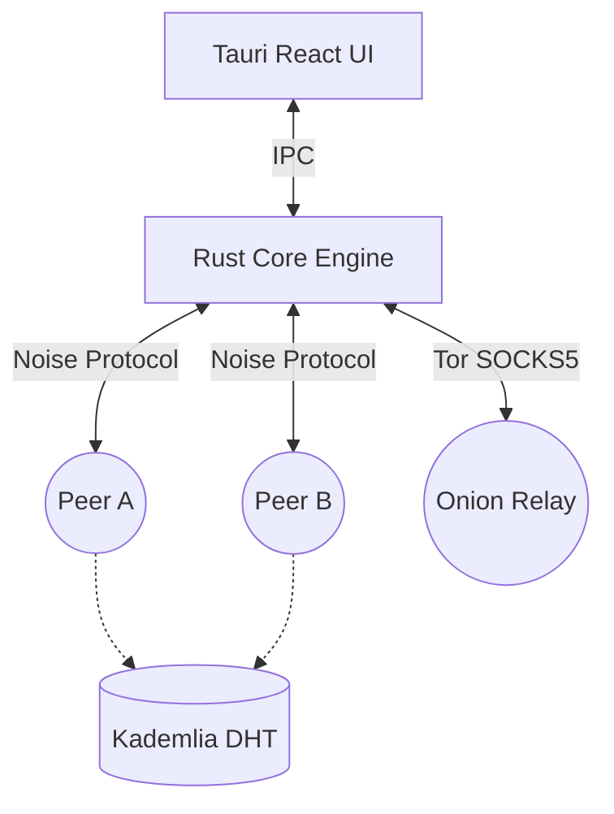

<div align="center">
  <h1>بِسْمِ اللَّهِ الرَّحْمَنِ الرَّحِيمِ</h1>
  <h2>AlterChat</h2>
  <p><b>Serverless, Peer-to-Peer, Sovereign Messaging Network</b></p>
  
  [](https://www.rust-lang.org)
  [](https://tauri.app/)
  [](https://reactjs.org/)
  [](LICENSE)
</div>

---

AlterChat is a **100% decentralized, serverless, peer-to-peer messaging application** built with Rust (libp2p) and Tauri (React/TypeScript). It completely eliminates the need for central infrastructure, accounts, phone numbers, or servers.

Every node is an equal participant in a self-sustaining mesh network.

## 🚀 Key Technical Features

### 1. Peer-to-Peer Architecture (libp2p)



- **Zero Servers:** No central messaging database. Communication happens via DHT (Kademlia), Gossipsub, and direct TCP/QUIC connections.
- **NAT Traversal:** Built-in STUN/TURN, AutoNAT, and hole-punching for connecting peers across restrictive firewalls.
- **Relay Fallback:** Automatic relay nodes if direct connection is impossible.
- **Pluggable Transports:** Support for TCP, QUIC, WebSocket, Tor (SOCKS5), and Obfs4/Snowflake obfuscation.

### 2. Multi-Layer Encryption
- **Transport Layer:** Noise Protocol Framework (XX handshake) encrypts all raw TCP/QUIC traffic between peers.
- **Application Layer (X3DH & Double Ratchet):** Perfect Forward Secrecy (PFS) and Post-Compromise Security (PCS). Pre-key bundles are rotated automatically every 7 days and stored on the DHT.
- **Media Encryption:** WebRTC streams are secured via Insertable Streams (AES-256-GCM per-frame encryption) *before* hitting the WebRTC transport.
- **At-Rest Encryption:** Local SQLite databases are encrypted with AES-256-GCM using Argon2 key derivation from the user's master password.

### 3. Sovereign Storage & Amnesic Mode
- Nodes store only what they need.
- **Amnesic Mode (`:memory:`):** Run the entire node exclusively in RAM. Database and keypairs vanish instantly upon shutdown, leaving zero forensic trace.

### 4. Advanced Networking & Defense
- **Proof-of-Work (PoW):** Prevent network spam by requiring computational proof (Argon2id hashing) before accepting direct messages or large files from untrusted peers.
- **Chaff Traffic:** Generates dummy packets (padded to 512 bytes) to obscure traffic patterns from passive observers (ISP/DPI analysis).
- **SFU Election:** For group calls, the network dynamically selects the peer with the highest system capacity and PoW trust score as the local WebRTC SFU host.

---

## 🛠️ Build & Installation

### Prerequisites
- [Rust](https://www.rust-lang.org/tools/install) (1.85.0+)
- [Node.js](https://nodejs.org/) (20+)
- Build tools (Visual Studio Build Tools for Windows, Xcode for macOS, `build-essential` for Linux).

### Running Locally
```bash
# Clone the repository
git clone https://github.com/your-org/alterchat.git
cd alterchat

# Install frontend dependencies
cd alterchat-ui
npm install

# Run the Tauri application in dev mode
npm run tauri dev
```

### Production Build
```bash
npm run tauri build
```
The compiled binaries will be available in `src-tauri/target/release/bundle/`.

---

## 📂 Project Structure

- `alterchat-core/`: The headless Rust library containing all p2p networking, cryptography, spam-prevention, and storage logic.
- `alterchat-cli/`: A lightweight command-line interface for running a headless node.
- `alterchat-ui/`: The Tauri application wrapping `alterchat-core` into a React-based Desktop App.
  - `src/`: React frontend (TypeScript, CSS).
  - `src-tauri/`: Tauri backend bridge linking React with `alterchat-core`.
- `libp2p-community-tor/`: Custom libp2p transport integration for routing traffic through the Tor anonymity network.

---

## 🔐 Security & Threat Model
Please refer to the [THREAT_MODEL.md](THREAT_MODEL.md) for a detailed breakdown of attack vectors (Sybil, Eclipse, Passive Observation) and our mitigation strategies.

For architectural decisions, refer to [ARCHITECTURE.md](ARCHITECTURE.md).

---

## 🖤 Support & Donate
If you believe in decentralized, censorship-resistant communication and want to support the ongoing development of AlterChat, consider donating. Your support helps keep the network sovereign, private, and independent.

- **Monero (XMR):** `43bMdGQAkByAkbiGkgsuGbWf5afr2RBa42swxuqe7M8ohUSVbzaFAQabDivDtLcXJwQDNztZyhMSoiFkSvsCNouV2jACZyA` _(Privacy focused)_
- **Bitcoin (BTC):** `bc1q66wc9qq5w5k219ayv9mgm9jc3dkan757a7ufst`
- **Ethereum (ETH / ERC-20):** `0xC47BDDc11F70eb48f3c261186BdAA5A16E4448D0`

