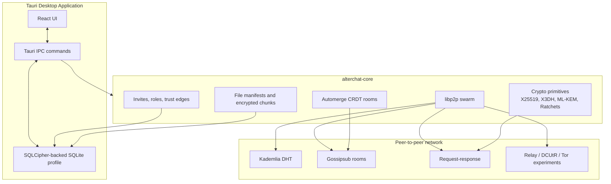

<div align="center">
  <h1>بِسْمِ اللَّهِ الرَّحْمَنِ الرَّحِيمِ</h1>
  <h2>AlterChat</h2>
  <p><strong>Local-first, peer-to-peer, zero-trust communication workspace</strong></p>

  [](https://github.com/onurbaydas/AlterChat/actions/workflows/ci.yml)
  [](https://www.rust-lang.org/)
  [](https://tauri.app/)
  [](https://react.dev/)
  [](LICENSE)
</div>

---

## Overview

AlterChat is an experimental secure messaging stack built around a simple
principle: identity, history, policy, and keys should belong to the user, not to
a central service.

The repository combines a Rust/libp2p protocol core with a Tauri desktop
application. The current implementation focuses on local-first encrypted
profiles, peer discovery, CRDT-backed rooms, direct messages, trust controls,
role-based room governance, file chunking, WebRTC signaling, onion packet
experiments, and a small bootstrap daemon for community-run discovery nodes.

This is security-sensitive software and should be treated as an alpha-stage
research implementation until it has received independent review. The codebase
contains real cryptographic building blocks, but the protocol and application
surface are still evolving.

## Table of Contents

- [Why AlterChat](#why-alterchat)
- [Current Capabilities](#current-capabilities)
- [Repository Layout](#repository-layout)
- [Architecture at a Glance](#architecture-at-a-glance)
- [Security Posture](#security-posture)
- [Quick Start](#quick-start)
- [Running the Desktop App](#running-the-desktop-app)
- [Running a Bootstrap Node](#running-a-bootstrap-node)
- [Operational Concepts](#operational-concepts)
- [Development Workflow](#development-workflow)
- [Documentation Map](#documentation-map)
- [Project Status](#project-status)
- [License](#license)
- [Support](#support)

## Why AlterChat

Most chat systems hide complexity behind accounts, service operators, and
central message stores. AlterChat goes in the opposite direction:

- **No central account authority:** a peer identity is derived from a local
  libp2p Ed25519 keypair.
- **Local-first storage:** profiles, settings, rooms, private messages, trust
  edges, room roles, file manifests, and plugin records live in a local SQLite
  database opened through SQLCipher support.
- **Peer-to-peer network model:** libp2p provides Kademlia, mDNS, Identify,
  Gossipsub, request-response, relay, DCUtR, TCP, QUIC, Noise, and Yamux.
- **Human-verifiable trust:** contacts can be given local trust levels, blocked,
  muted, verified with safety numbers, and connected through signed trust edges.
- **Defense-in-depth design:** transport encryption, profile encryption, message
  encryption, optional traffic padding, proof-of-work primitives, and onion
  packet experiments are kept as separate layers.
- **No silent cloud fallback:** the app is designed around explicit peer
  routing, local configuration, and community bootstrap nodes.

## Current Capabilities

### Messaging

- Global CRDT room named `alterchat-global`.
- Joinable/savable group rooms with optional room passwords.
- Direct peer messages with local message history.
- Message TTL support in the UI and local cleanup path.
- Search index for room and DM text.
- Anonymous channel command path for temporary room identifiers.

### Identity and Profiles

- Password-derived profile names:
  - `alterchat_<hash-prefix>.db`
  - `keypair_<hash-prefix>.bin`
- Amnesic mode using in-memory paths.
- Encrypted libp2p keypair loading/generation.
- X25519 offline public key generation for peer bootstrap and safety numbers.
- `alterchat://connect?peer=...&pk=...` URI generation.

### Cryptography

- Ed25519 identity keys through libp2p.
- X25519 public-key encryption for peer payloads.
- AES-256-GCM for local encrypted payloads and file chunks.
- Argon2id-based file encryption helpers.
- X3DH-style shared-secret generation with ML-KEM-768 hybrid material.
- Double Ratchet implementation with skipped-message handling.
- Simpler symmetric ratchet compatibility path for current DM flows.
- Safety number derivation from peer public keys.
- Sealed-sender style encrypted envelope helpers.

### Networking

- libp2p Kademlia DHT for discovery and records.
- mDNS for local-network zero-configuration discovery.
- Gossipsub for room CRDT state publication.
- request-response protocol for files, DMs, capabilities, plugin events, PoW
  messages, WebRTC signaling, and onion forwarding.
- Relay server/client and DCUtR behaviours are wired into the swarm.
- Tor transport integration through the vendored `libp2p-community-tor` crate.
- QUIC transport preference path.
- I2P and SOCKS5 configuration fields exist, with I2P SOCKS proxy routing still
  marked as TODO in code.

### Governance and Trust

- Signed invite tokens with expiry, use limits, and permissions.
- Default room roles and signed permission grants.
- Signed trust edges.
- Local trust thresholds for DMs, files, and invites.
- Local peer controls: block, mute, rate limit, and PoW requirement flags.
- Distributed invite revocation record path.

### Files, Media, and Storage

- File manifests with 256 KiB chunking.
- AES-256-GCM chunk encryption plus plaintext hash verification.
- Storage quotas and retention settings.
- Local chunk store under `alterchat_storage/<profile>`.
- WebRTC signaling over libp2p request-response.
- Experimental media E2EE path using browser insertable streams.
- SFU host election heuristic based on local/peer capacity scores.

### Plugins and Extensibility

- Plugin manifest and capability policy model in `alterchat-core`.
- Tauri commands to save and list plugin manifests.
- Plugin event request-response messages.
- Plugin execution remains a sensitive extension surface and should be reviewed
  carefully before enabling untrusted code.

## Repository Layout

```text
AlterChat-main/
├─ alterchat-core/             Rust protocol, crypto, storage, network, governance
├─ alterchat-ui/               Tauri v2 desktop app with React frontend
│  ├─ src/                     React UI, WebRTC helpers, components
│  └─ src-tauri/               Tauri backend, SQLite schema, IPC commands
├─ alterchat-bootstrap/        Headless Kademlia bootstrap node
├─ libp2p-community-tor/       Vendored Tor transport adapter for libp2p
├─ .github/                    CI, release workflow, issue and PR templates
├─ ARCHITECTURE.md             Protocol and module architecture
├─ THREAT_MODEL.md             Threat model and mitigations
├─ SECURITY.md                 Vulnerability reporting policy
└─ CONTRIBUTING.md             Contribution workflow
```

## Architecture at a Glance



The detailed architecture is documented in [ARCHITECTURE.md](ARCHITECTURE.md).

## Security Status

> **Alpha Software — Not Independently Audited**
>
> AlterChat has NOT undergone an independent cryptographic or security audit.
> The cryptographic primitives (X3DH, ML-KEM-768, Double Ratchet) are implemented
> from standard specifications but implementation correctness is unverified.
> Do not use for high-stakes communications until an audit is completed.

Known limitations in v0.1.0:

- Group message rooms (Gossipsub) do not have per-room end-to-end encryption
  in v0.1.0.
- DHT queries and peer connections reveal metadata to network observers.
- Panic wipe uses best-effort file overwrite (SSD wear-leveling may retain
  data).
- Pluggable transport obfuscation (obfs4, Snowflake) is not wired to the
  transport layer.

## Security Posture

AlterChat is designed with strong security goals, but the repository should not
be advertised as audited or production-ready.

Implemented foundations:

- libp2p Noise transport encryption.
- SQLCipher-backed local database opening through `rusqlite`.
- Argon2id and AES-256-GCM helper functions for encrypted local material.
- Ed25519 signatures for governance artifacts.
- X25519 and ML-KEM-768 hybrid material in the X3DH path.
- Double Ratchet module with unit tests for bidirectional and out-of-order
  messages.
- Local trust thresholds, block/mute controls, and rate limiting.
- Traffic padding, chaff payload, and proof-of-work primitives.
- Panic-wipe commands for active profile, message database, or all local
  profiles.

Important limitations:

- No independent security audit has been completed.
- The Tauri config currently has `csp: null`; production releases should define
  a strict Content Security Policy.
- Some privacy features are experimental or partially wired. I2P SOCKS routing,
  full pluggable transport deployment, and production-grade relay policy need
  additional implementation review.
- WebRTC media E2EE uses browser APIs that may degrade when peer keys are not
  available.
- The local database key is derived from the login password path; review and
  hardening are recommended before high-risk use.

See [THREAT_MODEL.md](THREAT_MODEL.md) and [SECURITY.md](SECURITY.md).

## Quick Start

### Prerequisites

- **Rust 1.95+**. The current dependency graph uses `sysinfo 0.39.x`, which
  requires Rust 1.95 or newer.
- **Node.js 20+** and npm.
- **Tauri v2 system dependencies** for your platform.
- On Linux, install WebKitGTK and related build packages.

Debian/Ubuntu example:

```bash
sudo apt update
sudo apt install -y \
  build-essential curl wget file libssl-dev \
  libgtk-3-dev libayatana-appindicator3-dev librsvg2-dev \
  libwebkit2gtk-4.1-dev
```

Clone:

```bash
git clone https://github.com/onurbaydas/AlterChat.git
cd AlterChat
```

Check the Rust workspace:

```bash
rustup update stable
cargo check --workspace
```

If `cargo check` fails with a `sysinfo requires rustc 1.95` message, update your
Rust toolchain first.

## Running the Desktop App

```bash
cd alterchat-ui
npm install
npm run tauri dev
```

Build a desktop bundle:

```bash
cd alterchat-ui
npm run tauri build
```

The Tauri build output is created under `alterchat-ui/src-tauri/target/`.

## Running a Bootstrap Node

The bootstrap daemon is intentionally small: it creates a libp2p Kademlia server
node, listens on TCP port `4001`, identifies peers, and adds their listen
addresses to the DHT routing table.

```bash
cargo run --package alterchat-bootstrap --release
```

Expected output includes a multiaddr similar to:

```text
/ip4/0.0.0.0/tcp/4001/p2p/<PEER_ID>
```

Community bootstrap addresses are currently configured as an empty list in
`alterchat-core/src/network.rs`. Add real community-operated multiaddrs through
reviewed pull requests, not as a central authority.

### Configuring Bootstrap Nodes via Environment Variable

You can supply additional bootstrap nodes at runtime without modifying source
code. Set the `ALTERCHAT_BOOTSTRAP` environment variable to a comma-separated
list of multiaddrs:

```bash
export ALTERCHAT_BOOTSTRAP="\
/ip4/1.2.3.4/tcp/4001/p2p/12D3KooW...,\
/ip4/5.6.7.8/tcp/4001/p2p/12D3KooW..."
cargo run --package alterchat-bootstrap --release
```

These addresses are merged with the hardcoded `COMMUNITY_BOOTSTRAP_ADDRS` list
at startup. User-supplied addresses (via `NetworkPrivacyConfig.bootstrap_addrs`)
take precedence, followed by env-var entries, then the compiled-in list.

## Operational Concepts

### Profiles

On login, the password is hashed to derive profile-specific local paths. Normal
mode stores a SQLCipher-backed profile database and encrypted keypair file on
disk. Amnesic mode uses in-memory paths and is intended for sessions that should
not leave a durable profile.

### Rooms

Rooms use Automerge CRDT documents. A local room state is saved in SQLite and
published over Gossipsub. Peers merge incoming CRDT bytes and emit UI history
events.

### Direct Messages

Direct messages are sent over libp2p request-response. The codebase contains
both a symmetric ratchet state path and a fuller Double Ratchet module. The X3DH
hybrid handshake path is present and should be the preferred direction for
future protocol hardening.

### Trust

Trust is local by design. Peer trust scores, block/mute state, PoW requirement,
and rate limits are stored in the local database. Signed trust edges can be
created and listed, but users remain responsible for deciding what trust means
for their own device.

### Files

Files can be split into 256 KiB chunks, encrypted with AES-256-GCM, written to a
profile-specific local chunk directory, and indexed by manifest. Retention and
quota controls live in storage settings.

### Panic Wipe

The panic-wipe path attempts to overwrite files with zeroes before deletion and
then exits the process. On modern SSDs, journals, snapshots, cloud sync, and OS
caches can still retain data. Treat panic wipe as best-effort local hygiene, not
forensic erasure.

## Development Workflow

Common checks:

```bash
cargo fmt --all -- --check
cargo clippy --workspace --all-targets --all-features -- -D warnings
cargo test --workspace
```

Frontend checks:

```bash
cd alterchat-ui
npm install
npm run build
```

Security-sensitive changes should include tests or a clear manual verification
note. This includes changes to:

- key derivation and encrypted storage
- X3DH, Double Ratchet, sealed sender, or safety numbers
- DHT record keys and peer routing
- SQLite schema or profile migration
- Tauri command allowlists and IPC payloads
- panic wipe or vault import/export
- file chunk encryption and quota enforcement

See [CONTRIBUTING.md](CONTRIBUTING.md) for the full process.

## Documentation Map

- [ARCHITECTURE.md](ARCHITECTURE.md): module-by-module design and event flow.
- [THREAT_MODEL.md](THREAT_MODEL.md): attacker model, mitigations, and open
  risks.
- [SECURITY.md](SECURITY.md): private vulnerability reporting policy.
- [CONTRIBUTING.md](CONTRIBUTING.md): development and review workflow.
- [alterchat-ui/README.md](alterchat-ui/README.md): desktop frontend details.
- [libp2p-community-tor/README.md](libp2p-community-tor/README.md): Tor
  transport notes and misuse warnings.

## Project Status

AlterChat is an active prototype. The codebase is valuable for experimentation,
local network testing, and protocol development, but it needs hardening before
being trusted for high-risk communication.

Suggested next milestones:

- Replace `csp: null` with a production CSP.
- Decide on one canonical DM protocol path and migrate old state safely.
- Finish I2P/SOCKS5 outbound routing or remove unsupported settings from the UI.
- Add migration tests for SQLite schema evolution.
- Add end-to-end integration tests for two local nodes.
- Document and test bootstrap-node admission policy.
- Run independent cryptographic and Tauri security reviews.

## License

AlterChat is licensed under the [GNU Affero General Public License v3.0](LICENSE).

## Support

If you want to support decentralized, censorship-resistant communication
research, donations are welcome:

- **Monero (XMR):** `43bMdGQAkByAkbiGkgsuGbWf5afr2RBa42swxuqe7M8ohUSVbzaFAQabDivDtLcXJwQDNztZyhMSoiFkSvsCNouV2jACZyA`
- **Bitcoin (BTC):** `bc1q66wc9qq5w5k219ayv9mgm9jc3dkan757a7ufst`
- **Ethereum (ETH / ERC-20):** `0xC47BDDc11F70eb48f3c261186BdAA5A16E4448D0`
